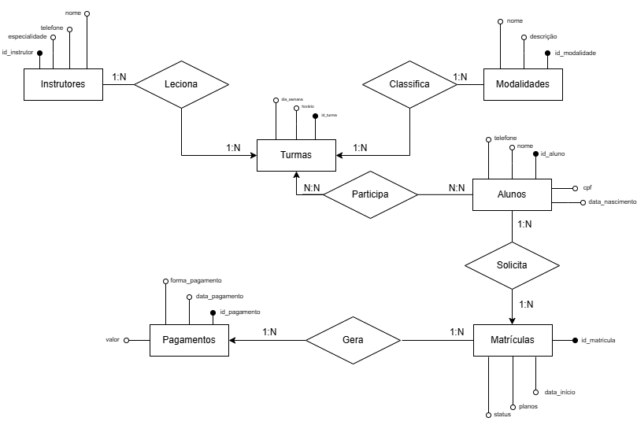
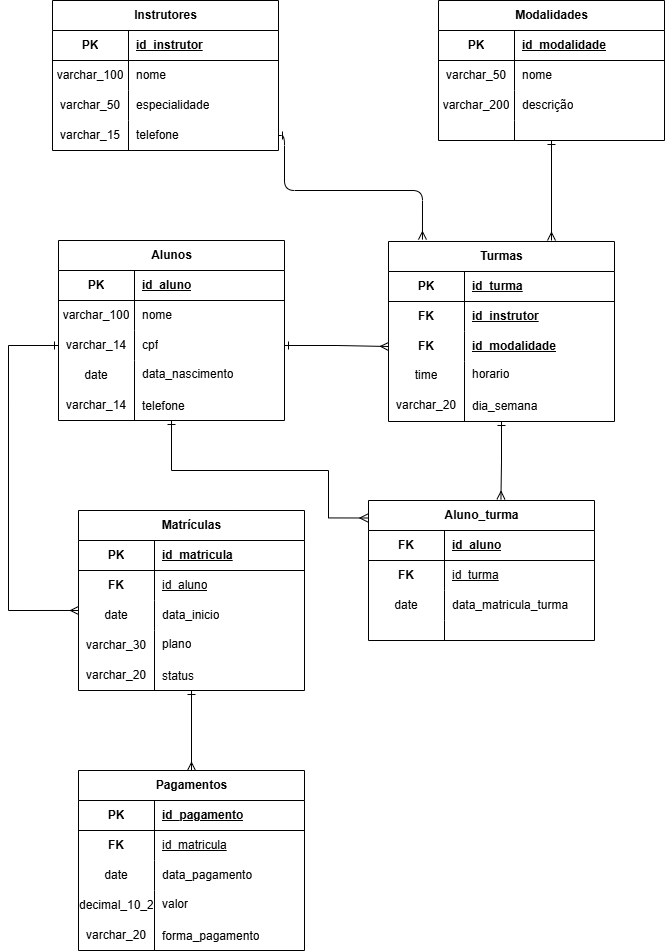

# FDB - Banco de Dados de uma Academia

Projeto de banco de dados relacional para o sistema de gestão de uma academia/estúdio de modalidades, desenvolvido em MySQL.

## Sobre o projeto

O banco modela o funcionamento de uma academia: instrutores que dão aulas em turmas de diferentes modalidades, alunos que se matriculam e participam dessas turmas, e o controle de pagamentos de cada matrícula.

## Estrutura

O banco é composto por 7 tabelas:

- **Instrutores** - dados dos professores
- **Modalidades** - tipos de aula oferecidos (musculação, yoga, crossfit, etc.)
- **Alunos** - cadastro dos alunos
- **Turmas** - aulas vinculadas a um instrutor e uma modalidade
- **Aluno_turma** - tabela associativa que relaciona alunos às turmas (relacionamento N:N)
- **Matriculas** - matrícula de um aluno na academia (plano, status)
- **Pagamentos** - pagamentos referentes a cada matrícula

### Relacionamentos

- Instrutor → Turma (1:N)
- Modalidade → Turma (1:N)
- Aluno → Matrícula (1:N)
- Matrícula → Pagamento (1:N)
- Aluno ↔ Turma (N:N, via Aluno_turma)

## Diagramas

O projeto conta com dois diagramas, em níveis diferentes de abstração:

### Esquema Conceitual (MER)

Arquivos: `esquema_conceitual.drawio` / `esquema_conceitual.drawio.png`

Representa o negócio no formato clássico de Modelo Entidade-Relacionamento: entidades (retângulos), relacionamentos nomeados como verbos (losangos) e atributos (bolinhas), sem se preocupar ainda com chaves ou tipos de dado de implementação.

Relacionamentos representados:
- **Instrutores** *Leciona* **Turmas** (1:N)
- **Modalidades** *Classifica* **Turmas** (1:N)
- **Alunos** *Participa* **Turmas** (N:N)
- **Alunos** *Solicita* **Matrículas** (1:N)
- **Matrículas** *Gera* **Pagamentos** (1:N)

### Esquema Lógico / Relacional

Arquivo: `FBD.drawio.png`

Já é a tradução do modelo conceitual para tabelas: mostra cada entidade como uma tabela com suas colunas, tipos de dado (varchar, date, decimal, time), chave primária (PK) e chaves estrangeiras (FK), pronta para ser implementada no banco.

## Arquivos do projeto

- **`Banco de Dados da academia.sql`** — script principal: criação do banco, das 7 tabelas e inserção de 50 registros por tabela.
- **`Consultas.sql`** — consultas de exemplo (SELECT + WHERE, JOIN, GROUP BY/HAVING, funções de agregação, matemáticas, de string e de data/hora), já com os resultados de cada consulta.

> Os dados (nomes, CPFs, telefones, datas) são fictícios, gerados apenas para fins de teste e demonstração do banco.

## Como executar

1. Abra o **MySQL Workbench** e conecte na sua instância local.
2. Vá em **File → Open SQL Script...** e selecione **`Banco de Dados da academia.sql`**.
3. Clique no ícone de raio (⚡) para executar o script inteiro. Ele cria o banco `academia` do zero (pode rodar mais de uma vez sem dar erro) e já popula todas as tabelas com 50 registros cada.
4. Em seguida, abra **`Consultas.sql`** da mesma forma e execute para ver os exemplos de SELECT, JOIN, GROUP BY e funções (agregação, matemáticas, string e data/hora).

## Tecnologia

- SGBD: MySQL 8.0
- Ferramenta: MySQL Workbench
